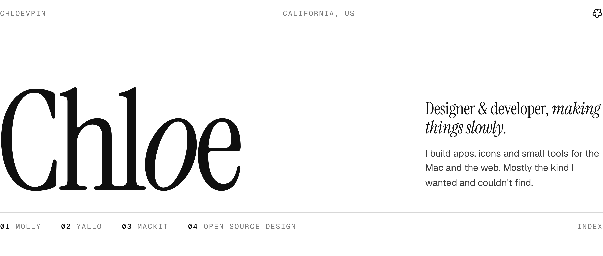
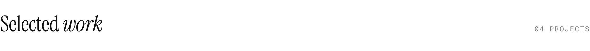
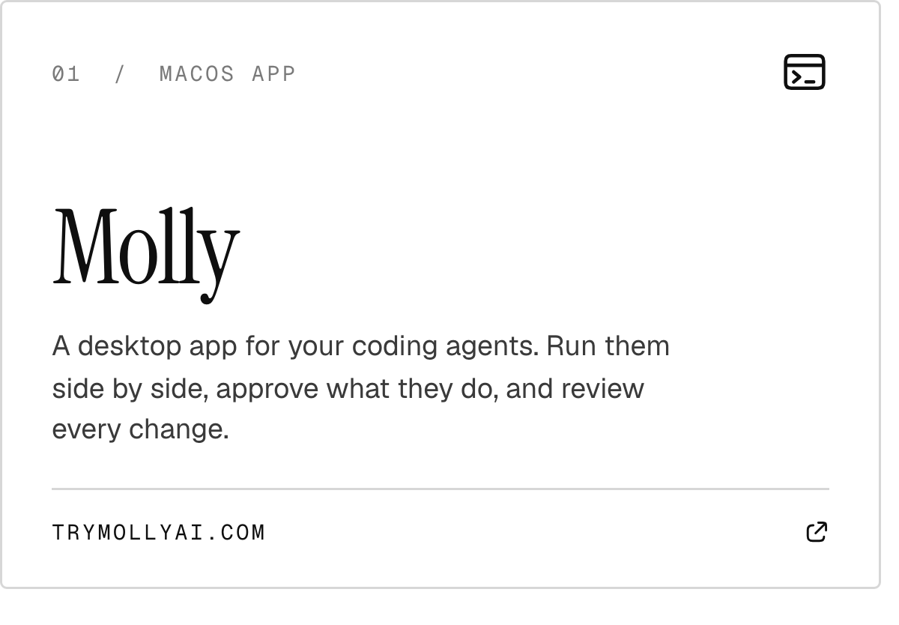
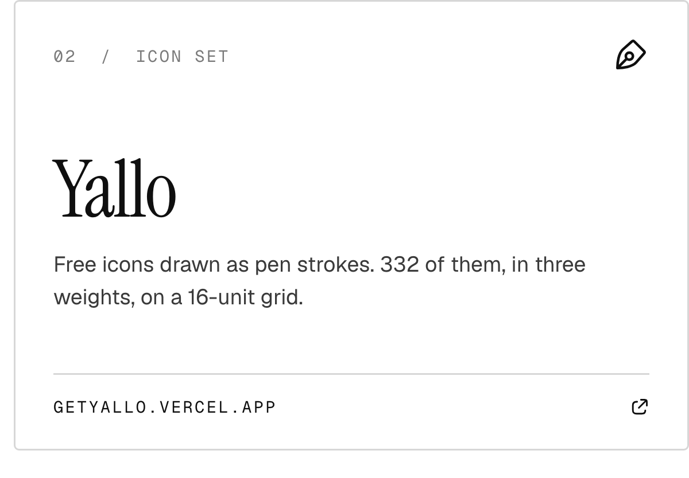
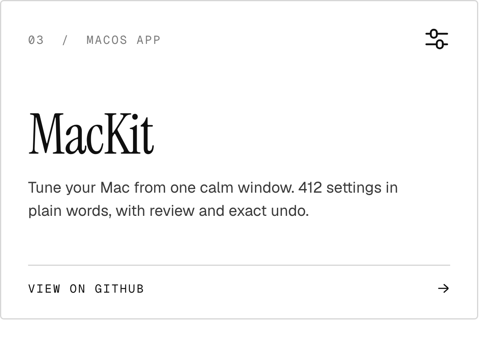
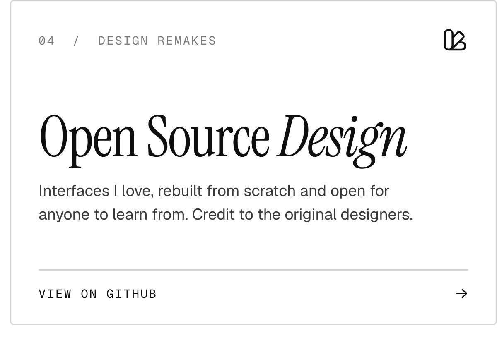

<picture><source media="(prefers-color-scheme: dark)" srcset="./assets/header-dark.png"></picture>

<picture><source media="(prefers-color-scheme: dark)" srcset="./assets/section-dark.png"></picture>

<a href="https://trymollyai.com"><picture><source media="(prefers-color-scheme: dark)" srcset="./assets/card-molly-dark.png"></picture></a><a href="https://getyallo.vercel.app"><picture><source media="(prefers-color-scheme: dark)" srcset="./assets/card-yallo-dark.png"></picture></a><a href="https://github.com/ChloeVPin/MacKit"><picture><source media="(prefers-color-scheme: dark)" srcset="./assets/card-mackit-dark.png"></picture></a><a href="https://github.com/ChloeVPin/Open-Source-Design"><picture><source media="(prefers-color-scheme: dark)" srcset="./assets/card-open-source-design-dark.png"></picture></a>

<picture><source media="(prefers-color-scheme: dark)" srcset="./assets/say-dark.png"></picture>

<a href="https://chloevalesquez.vercel.app"><picture><source media="(prefers-color-scheme: dark)" srcset="./assets/link-website-dark.png"></picture></a><a href="https://x.com/chloevalesquez"><picture><source media="(prefers-color-scheme: dark)" srcset="./assets/link-x-dark.png"></picture></a><a href="mailto:chloevalesquez@gmail.com"><picture><source media="(prefers-color-scheme: dark)" srcset="./assets/link-email-dark.png"></picture></a><a href="https://discord.com/servers/chloe-s-coding-clubhouse-1418626982861733911"><picture><source media="(prefers-color-scheme: dark)" srcset="./assets/link-discord-dark.png"></picture></a>

<picture><source media="(prefers-color-scheme: dark)" srcset="./assets/colophon-dark.png"></picture>
